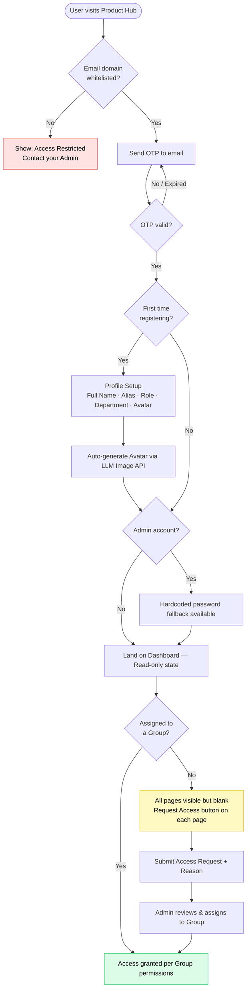
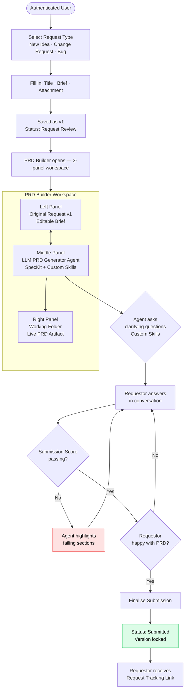
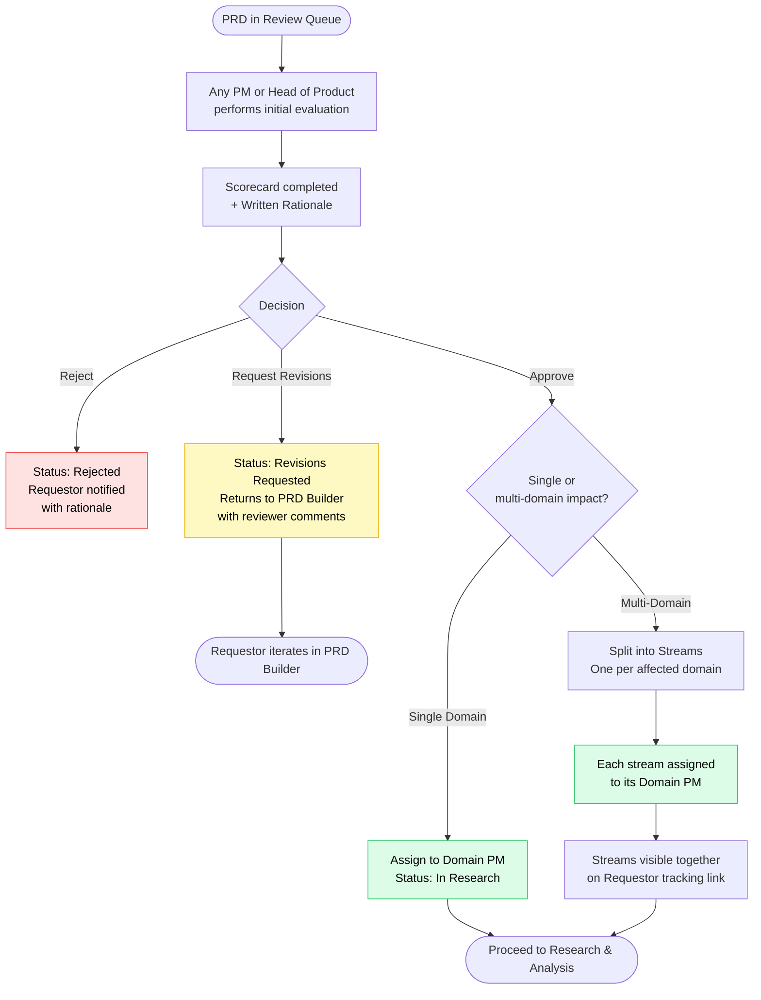
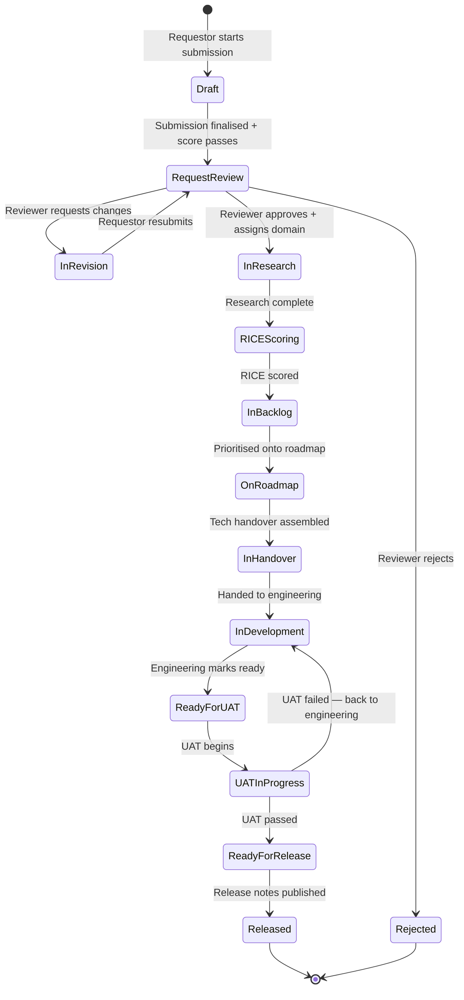

# Product Hub — Lifecycle Flows

> Auto-updated as requirements are defined. Each section covers a lifecycle stage with decision points and persona actions.

---

## 1. Register & Login

---

## 2. Submission & PRD Builder

---

## 3. Product Processing & Evaluation

---

## Request Status State Machine

